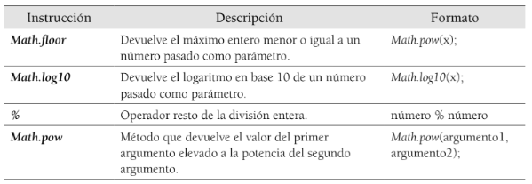

<h1>Amstrong</h1>
<h2>Enunciado:</h2>

Se quiere desarrollar un programa que determine si un número es un número de Amstrong. Un número de Amstrong es aquel que es igual a la suma de sus dígitos elevados a la potencia de su número de cifras.

Se quiere desarrollar un programa que determine si un número es un número de Amstrong. Un número de Amstrong es aquel que es igual a la suma de sus dígitos elevados a la potencia de su número de cifras.

371 = 33 + 73 + 13 = 27 + 343 + 1 = 371

